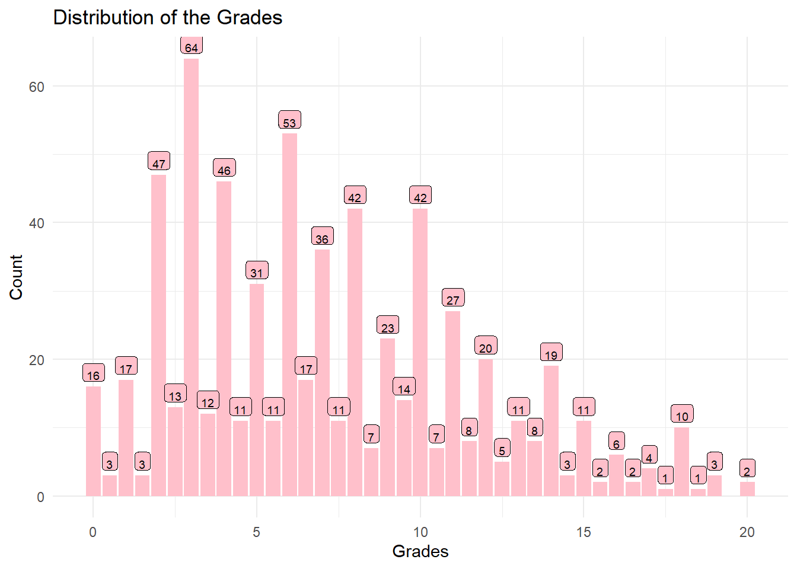
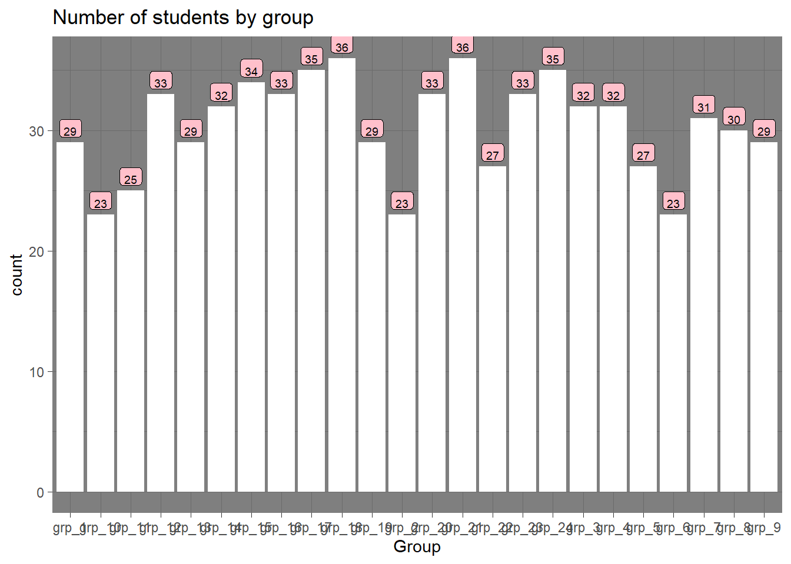
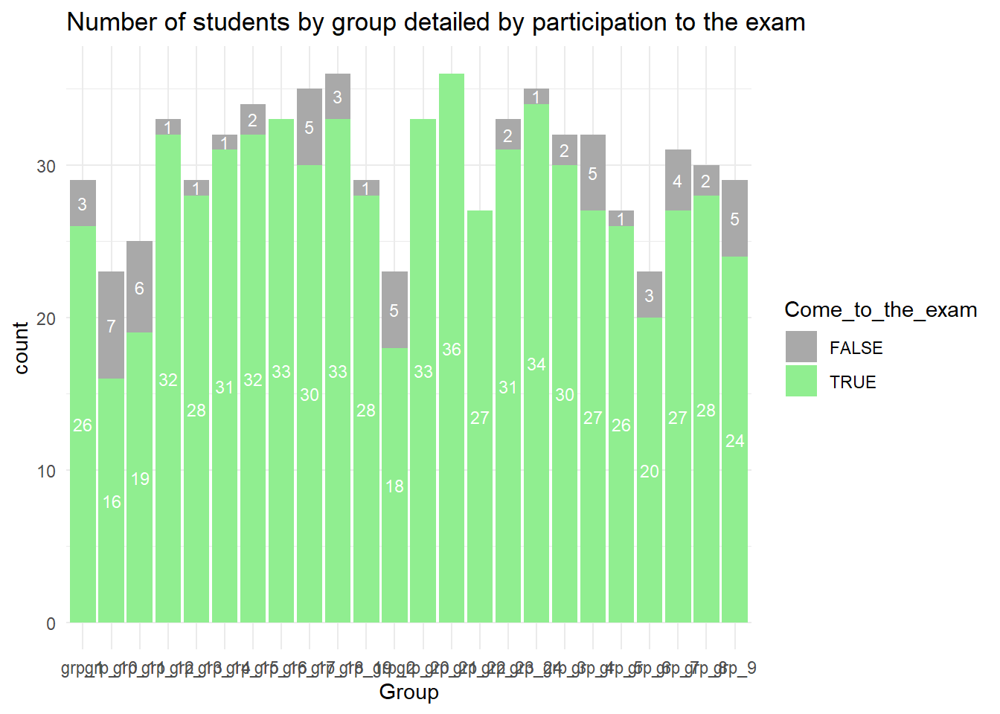
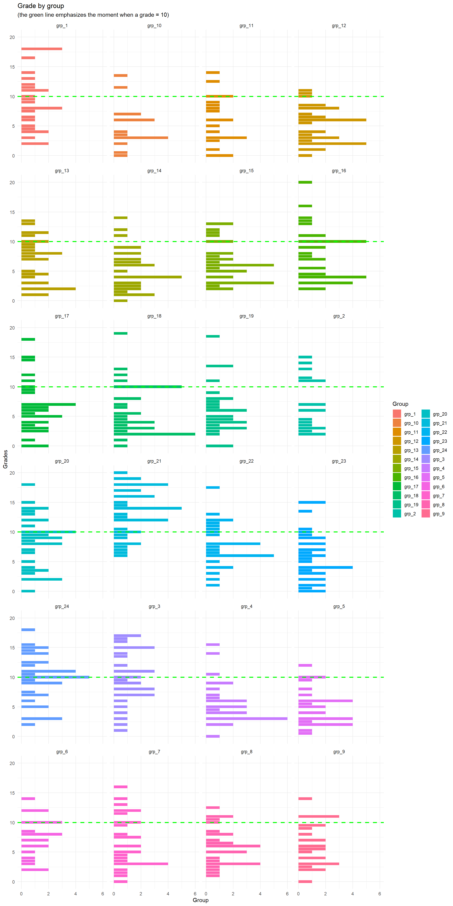
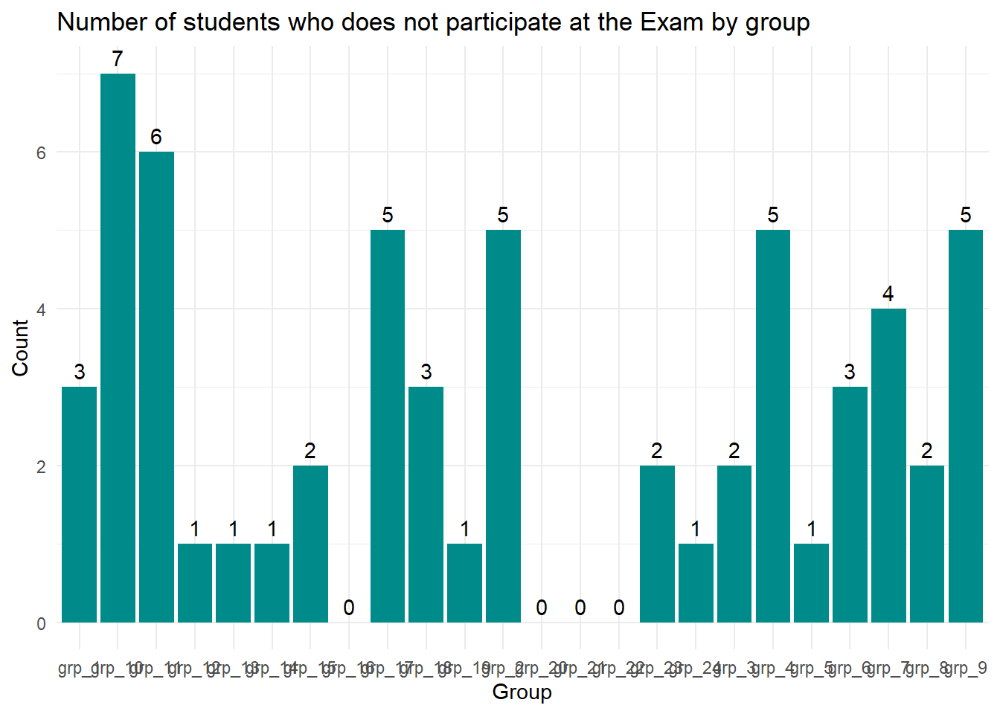

::: {.cell}

:::


<center>

# Dplyr-Lab (Lab of the 24th)

</center>

<center>GitHub link (URL) : <https://github.com/CBZ1310/r-101-grade-analysis></center>

## Exercise 1

### Question 1


::: {.cell}

:::

::: {.cell}

:::


### Question 2


::: {.cell}
::: {.cell-output-display}

`````{=html}
<table class=" lightable-minimal" style='font-family: "Trebuchet MS", verdana, sans-serif; margin-left: auto; margin-right: auto;'>
<caption>Exams - statistics</caption>
 <thead>
  <tr>
   <th style="text-align:center;"> Min </th>
   <th style="text-align:center;"> Median </th>
   <th style="text-align:center;"> Max </th>
   <th style="text-align:center;"> Mean </th>
   <th style="text-align:center;"> Standard Deviation </th>
  </tr>
 </thead>
<tbody>
  <tr>
   <td style="text-align:center;"> 0 </td>
   <td style="text-align:center;"> 6.5 </td>
   <td style="text-align:center;"> 20 </td>
   <td style="text-align:center;"> 7.15 </td>
   <td style="text-align:center;"> 4.38 </td>
  </tr>
</tbody>
</table>

`````

:::
:::

::: {.cell}
::: {.cell-output .cell-output-stdout}
```
Complementary data - Coefficient of variation = 61.27387 %
```
:::
:::


### Question 3


::: {.cell}
::: {.cell-output .cell-output-stdout}
```
60 students do not come at the exam
```
:::
:::


### Question 4


::: {.cell}
::: {.cell-output-display}
{width=672}
:::
:::

::: {.cell}
::: {.cell-output-display}
{width=672}
:::
:::


### Question 5


::: {.cell}

:::

::: {.cell}
::: {.cell-output-display}

`````{=html}
<table class=" lightable-minimal" style='font-family: "Trebuchet MS", verdana, sans-serif; margin-left: auto; margin-right: auto;'>
<caption>Number of students by group</caption>
 <thead>
  <tr>
   <th style="text-align:center;"> Group </th>
   <th style="text-align:center;"> Total_count </th>
   <th style="text-align:center;"> Student who comes to the exam </th>
   <th style="text-align:center;"> % of Student whp comes </th>
  </tr>
 </thead>
<tbody>
  <tr>
   <td style="text-align:center;"> grp_18 </td>
   <td style="text-align:center;"> 36 </td>
   <td style="text-align:center;"> 33 </td>
   <td style="text-align:center;"> 91.67 </td>
  </tr>
  <tr>
   <td style="text-align:center;"> grp_21 </td>
   <td style="text-align:center;"> 36 </td>
   <td style="text-align:center;"> 36 </td>
   <td style="text-align:center;"> 100.00 </td>
  </tr>
  <tr>
   <td style="text-align:center;"> grp_17 </td>
   <td style="text-align:center;"> 35 </td>
   <td style="text-align:center;"> 30 </td>
   <td style="text-align:center;"> 85.71 </td>
  </tr>
  <tr>
   <td style="text-align:center;"> grp_24 </td>
   <td style="text-align:center;"> 35 </td>
   <td style="text-align:center;"> 34 </td>
   <td style="text-align:center;"> 97.14 </td>
  </tr>
  <tr>
   <td style="text-align:center;"> grp_15 </td>
   <td style="text-align:center;"> 34 </td>
   <td style="text-align:center;"> 32 </td>
   <td style="text-align:center;"> 94.12 </td>
  </tr>
  <tr>
   <td style="text-align:center;"> grp_12 </td>
   <td style="text-align:center;"> 33 </td>
   <td style="text-align:center;"> 32 </td>
   <td style="text-align:center;"> 96.97 </td>
  </tr>
  <tr>
   <td style="text-align:center;"> grp_16 </td>
   <td style="text-align:center;"> 33 </td>
   <td style="text-align:center;"> 33 </td>
   <td style="text-align:center;"> 100.00 </td>
  </tr>
  <tr>
   <td style="text-align:center;"> grp_20 </td>
   <td style="text-align:center;"> 33 </td>
   <td style="text-align:center;"> 33 </td>
   <td style="text-align:center;"> 100.00 </td>
  </tr>
  <tr>
   <td style="text-align:center;"> grp_23 </td>
   <td style="text-align:center;"> 33 </td>
   <td style="text-align:center;"> 31 </td>
   <td style="text-align:center;"> 93.94 </td>
  </tr>
  <tr>
   <td style="text-align:center;"> grp_14 </td>
   <td style="text-align:center;"> 32 </td>
   <td style="text-align:center;"> 31 </td>
   <td style="text-align:center;"> 96.88 </td>
  </tr>
  <tr>
   <td style="text-align:center;"> grp_3 </td>
   <td style="text-align:center;"> 32 </td>
   <td style="text-align:center;"> 30 </td>
   <td style="text-align:center;"> 93.75 </td>
  </tr>
  <tr>
   <td style="text-align:center;"> grp_4 </td>
   <td style="text-align:center;"> 32 </td>
   <td style="text-align:center;"> 27 </td>
   <td style="text-align:center;"> 84.38 </td>
  </tr>
  <tr>
   <td style="text-align:center;"> grp_7 </td>
   <td style="text-align:center;"> 31 </td>
   <td style="text-align:center;"> 27 </td>
   <td style="text-align:center;"> 87.10 </td>
  </tr>
  <tr>
   <td style="text-align:center;"> grp_8 </td>
   <td style="text-align:center;"> 30 </td>
   <td style="text-align:center;"> 28 </td>
   <td style="text-align:center;"> 93.33 </td>
  </tr>
  <tr>
   <td style="text-align:center;"> grp_1 </td>
   <td style="text-align:center;"> 29 </td>
   <td style="text-align:center;"> 26 </td>
   <td style="text-align:center;"> 89.66 </td>
  </tr>
  <tr>
   <td style="text-align:center;"> grp_13 </td>
   <td style="text-align:center;"> 29 </td>
   <td style="text-align:center;"> 28 </td>
   <td style="text-align:center;"> 96.55 </td>
  </tr>
  <tr>
   <td style="text-align:center;"> grp_19 </td>
   <td style="text-align:center;"> 29 </td>
   <td style="text-align:center;"> 28 </td>
   <td style="text-align:center;"> 96.55 </td>
  </tr>
  <tr>
   <td style="text-align:center;"> grp_9 </td>
   <td style="text-align:center;"> 29 </td>
   <td style="text-align:center;"> 24 </td>
   <td style="text-align:center;"> 82.76 </td>
  </tr>
  <tr>
   <td style="text-align:center;"> grp_22 </td>
   <td style="text-align:center;"> 27 </td>
   <td style="text-align:center;"> 27 </td>
   <td style="text-align:center;"> 100.00 </td>
  </tr>
  <tr>
   <td style="text-align:center;"> grp_5 </td>
   <td style="text-align:center;"> 27 </td>
   <td style="text-align:center;"> 26 </td>
   <td style="text-align:center;"> 96.30 </td>
  </tr>
  <tr>
   <td style="text-align:center;"> grp_11 </td>
   <td style="text-align:center;"> 25 </td>
   <td style="text-align:center;"> 19 </td>
   <td style="text-align:center;"> 76.00 </td>
  </tr>
  <tr>
   <td style="text-align:center;"> grp_10 </td>
   <td style="text-align:center;"> 23 </td>
   <td style="text-align:center;"> 16 </td>
   <td style="text-align:center;"> 69.57 </td>
  </tr>
  <tr>
   <td style="text-align:center;"> grp_2 </td>
   <td style="text-align:center;"> 23 </td>
   <td style="text-align:center;"> 18 </td>
   <td style="text-align:center;"> 78.26 </td>
  </tr>
  <tr>
   <td style="text-align:center;"> grp_6 </td>
   <td style="text-align:center;"> 23 </td>
   <td style="text-align:center;"> 20 </td>
   <td style="text-align:center;"> 86.96 </td>
  </tr>
</tbody>
</table>

`````

:::
:::


### Question 6


::: {.cell}
::: {.cell-output-display}
{width=672}
:::
:::

::: {.cell}
::: {.cell-output-display}
{width=672}
:::
:::


### Question 7


::: {.cell}
::: {.cell-output-display}
{width=672}
:::
:::

::: {.cell}
::: {.cell-output-display}
{width=1152}
:::
:::


Grade is a discrete value so the following result is more than imperfect but I find easely to read the previous facet with geom_density


::: {.cell}
::: {.cell-output-display}
{width=1152}
:::
:::


### Question 8


::: {.cell}
::: {.cell-output-display}
Table: Number of students having missing exam by group

|Group  | Missed Exam|
|:------|-----------:|
|grp_10 |           7|
|grp_11 |           6|
|grp_17 |           5|
|grp_2  |           5|
|grp_4  |           5|
|grp_9  |           5|
|grp_7  |           4|
|grp_1  |           3|
|grp_18 |           3|
|grp_6  |           3|
|grp_15 |           2|
|grp_23 |           2|
|grp_3  |           2|
|grp_8  |           2|
|grp_12 |           1|
|grp_13 |           1|
|grp_14 |           1|
|grp_19 |           1|
|grp_24 |           1|
|grp_5  |           1|
|grp_16 |           0|
|grp_20 |           0|
|grp_21 |           0|
|grp_22 |           0|
:::
:::


### Question 9


::: {.cell}
::: {.cell-output-display}
{width=672}
:::
:::


### Question 10


::: {.cell}

:::


### Question 11

For this question, I'm not sure if I've understood the expected result. Indeed, I'm uncertain whether you want us to compute the number of all rows with NA for value or only the student where 'Exam' = NA


The number of missing grades, when all value = NA is are taking into account, is 7584.


::: {.cell}
::: {.cell-output .cell-output-stdout}
```
[1] 60
```
:::
:::


The number of missing grande, when only we take into account the value of Exam wich are equal to NA is 60.

### Question 12
